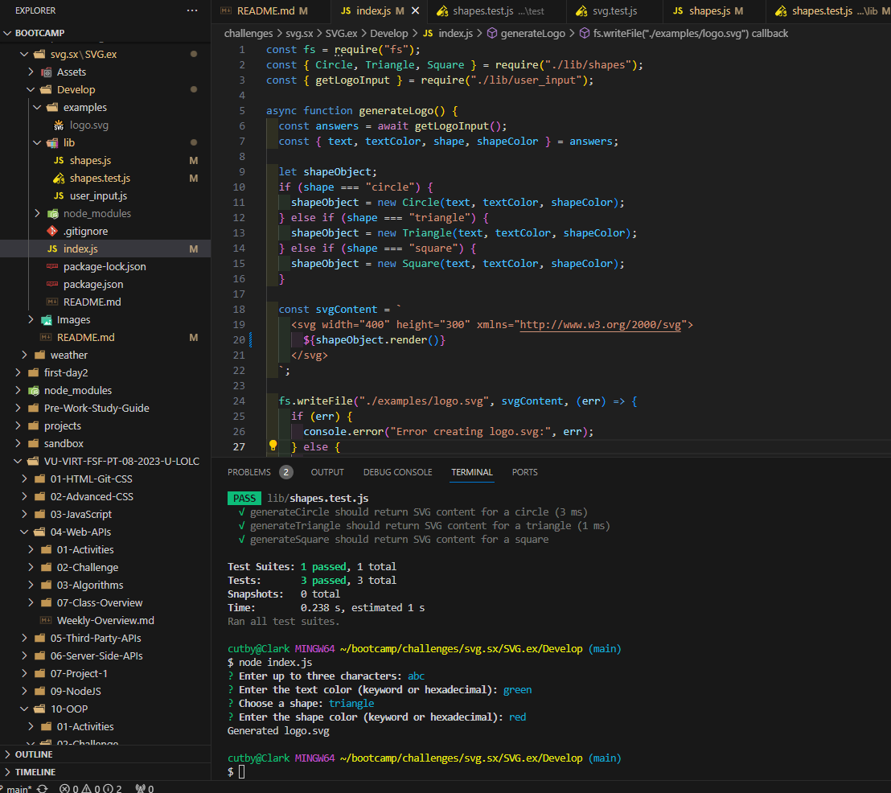

# SVG
# description : added code to make the user inputs change the way the image output looks.

# pictures: 

# links: 
https://github.com/Clarky13F/SVG.ex

https://drive.google.com/file/d/1fwuoC_PR8AGD1IZ1JS_txMy02c7d0gXl/view